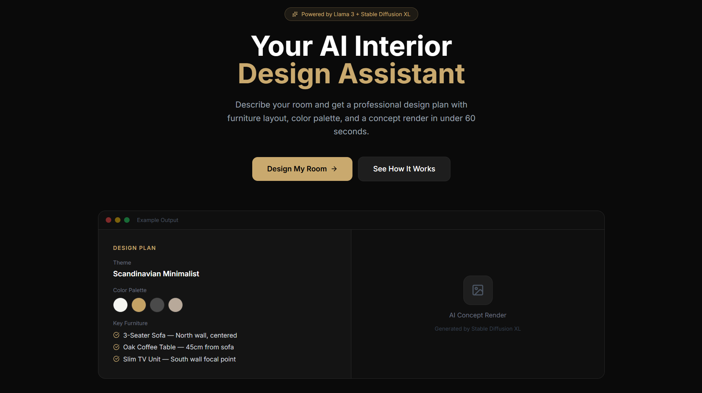
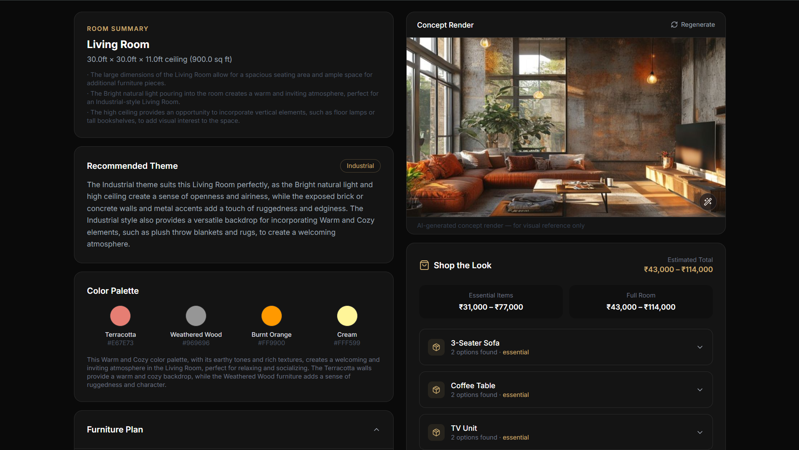

#  AI Interior Designer

> A full-stack Generative AI application that transforms room specifications into professional interior design plans with concept renders.

**Live Demo → [ai-interior-designer-blush.vercel.app](https://ai-interior-designer-blush.vercel.app)**
---

## Features

- **AI Design Planning** — Llama 3.3 70B reasons about your room dimensions, budget, and style to generate a complete interior design plan
- **Concept Renders** — Pollinations AI Flux Realism model generates photorealistic room renders from the design plan
- **Furniture Recommendations** — Budget-aware suggestions with real Indian market pricing from Pepperfry, Urban Ladder, Wooden Street, and IKEA
- **Multi-turn Refinement** — Chat with the AI to refine your design —  "change the color palette"
- **Room-specific Design** — Accurate furniture suggestions for Living Room, Bedroom, Home Office, Dining Room, and Studio Apartment
- **Zero Cost Deployment** — Fully deployed on Vercel + Render using free tiers

---

## Screenshots

### Landing Page


### Design Results


---

## Architecture

```
┌─────────────────────────────────────────────────────────┐
│                     User Browser                         │
│              Next.js 14 + Tailwind CSS v3               │
│                  Vercel (Frontend)                       │
└──────────────────────┬──────────────────────────────────┘
                       │ HTTP / REST API
┌──────────────────────▼──────────────────────────────────┐
│                  FastAPI Backend                          │
│              Python 3.11 + LangChain                    │
│                 Render (Backend)                         │
│                                                          │
│  ┌─────────────────┐    ┌──────────────────────────┐   │
│  │  Planning Engine │    │   Image Generation       │   │
│  │  LangChain +     │    │   Pollinations AI        │   │
│  │  Groq API        │    │   Flux Realism Model     │   │
│  │  Llama 3.3 70B   │    │                          │   │
│  └─────────────────┘    └──────────────────────────┘   │
│                                                          │
│  ┌─────────────────┐    ┌──────────────────────────┐   │
│  │  Furniture DB    │    │   Session Store          │   │
│  │  Indian Market   │    │   In-Memory              │   │
│  │  Pricing         │    │   (MVP)                  │   │
│  └─────────────────┘    └──────────────────────────┘   │
└─────────────────────────────────────────────────────────┘
```

---

## Tech Stack

| Layer | Technology |
|---|---|
| Frontend | Next.js 14, React, Tailwind CSS v3, Zustand |
| Backend | FastAPI, Python 3.11, LangChain |
| AI Planning | Groq API, Llama 3.3 70B Versatile |
| Image Generation | Pollinations AI, Flux Realism |
| Deployment | Vercel (frontend), Render (backend) |
| State Management | Zustand |
| HTTP Client | Axios |

---

## Getting Started

### Prerequisites

- Python 3.11+
- Node.js 18+
- Groq API key (free at [console.groq.com](https://console.groq.com))

### 1. Clone the Repository

```bash
git clone https://github.com/chiranjeevi0057/ai-interior-designer.git
cd ai-interior-designer
```

### 2. Backend Setup

```bash
cd backend

# Create virtual environment
python -m venv venv
venv\Scripts\activate  # Windows
# source venv/bin/activate  # Mac/Linux

# Install dependencies
pip install -r requirements.txt

# Create environment file
cp .env.example .env
# Edit .env and add your GROQ_API_KEY
```

### 3. Frontend Setup

```bash
cd frontend
npm install

# Create environment file
cp .env.example .env.local
# Edit .env.local — NEXT_PUBLIC_API_URL=http://localhost:8000
```

### 4. Run Locally

**Terminal 1 — Backend:**
```bash
cd backend
venv\Scripts\activate
uvicorn main:app --reload --port 8000
```

**Terminal 2 — Frontend:**
```bash
cd frontend
npm run dev
```

Open [http://localhost:3000](http://localhost:3000)

---

## Project Structure

```
ai-interior-designer/
├── backend/
│   ├── models/
│   │   ├── design_plan.py      # Core DesignPlan Pydantic schema
│   │   ├── intake.py           # User intake form schema
│   │   └── responses.py        # API response schemas
│   ├── routers/
│   │   ├── design.py           # Design generation endpoints
│   │   └── status.py           # Image status polling endpoint
│   ├── services/
│   │   ├── planner.py          # LangChain + Groq AI planning engine
│   │   ├── image_service.py    # Pollinations image generation
│   │   ├── furniture_db.py     # Indian furniture database
│   │   ├── prompt_synthesizer.py # Image prompt builder
│   │   └── prompts.py          # LLM prompt templates
│   ├── session/
│   │   └── store.py            # In-memory session management
│   ├── utils/
│   │   └── helpers.py          # Utility functions
│   ├── config.py               # Settings and configuration
│   ├── main.py                 # FastAPI application entry point
│   └── requirements.txt
├── frontend/
│   ├── app/
│   │   ├── page.tsx            # Landing page
│   │   ├── layout.tsx          # Root layout
│   │   └── design/
│   │       └── page.tsx        # Design flow page
│   ├── components/
│   │   └── design/
│   │       ├── IntakeForm.tsx      # 4-step intake form
│   │       ├── LoadingScreen.tsx   # AI processing screen
│   │       ├── ResultsPage.tsx     # Design results display
│   │       └── FurniturePanel.tsx  # Shop the Look panel
│   └── lib/
│       ├── api.ts              # API client functions
│       ├── store.ts            # Zustand state management
│       └── utils.ts            # Helper utilities
└── README.md
```

---

## API Endpoints

| Method | Endpoint | Description |
|---|---|---|
| POST | `/api/design/generate` | Generate complete design plan |
| POST | `/api/design/refine` | Refine existing design |
| GET | `/api/design/{session_id}` | Get current design plan |
| GET | `/api/design/{session_id}/furniture` | Get furniture recommendations |
| GET | `/api/status/image/{session_id}` | Poll image generation status |
| GET | `/health` | Health check |

Full API docs: [ai-interior-designer-backend.onrender.com/docs](https://ai-interior-designer-backend.onrender.com/docs)

---

## Environment Variables

### Backend `.env`

```env
LLM_PROVIDER=groq
GROQ_API_KEY=your_groq_api_key
GROQ_MODEL=llama-3.3-70b-versatile
ENVIRONMENT=development
SECRET_KEY=your_secret_key
SESSION_EXPIRY_MINUTES=60
FRONTEND_URL=http://localhost:3000
```

### Frontend `.env.local`

```env
NEXT_PUBLIC_API_URL=http://localhost:8000
NEXT_PUBLIC_APP_NAME=AI Interior Designer
NEXT_PUBLIC_ENVIRONMENT=development
NEXT_PUBLIC_POLL_INTERVAL=5000
```

---


## Key Technical Decisions

**Why Groq over local Ollama?**
Groq's hardware runs Llama 3.3 70B in 3–5 seconds — faster than running a 1B model locally on CPU. It also eliminates Windows IPv6/DNS networking issues with local inference.

**Why Pollinations AI for images?**
Free, no API key required, supports Flux Realism model which produces photorealistic interior renders. Falls back to curated Unsplash photos if generation fails.

**Why in-memory sessions over a database?**
For an MVP portfolio project, in-memory sessions eliminate infrastructure complexity. Sessions expire after 60 minutes which is sufficient for the demo use case.

**Why LangChain over raw API calls?**
LangChain provides retry logic, message formatting, and easy provider switching — switching from Ollama to Groq required changing one line in config.

---

## Author

**Chiranjeevi**
- GitHub: [@chiranjeevi0057](https://github.com/chiranjeevi0057)

---

## License

MIT License — feel free to use this project as a reference for your own AI applications.